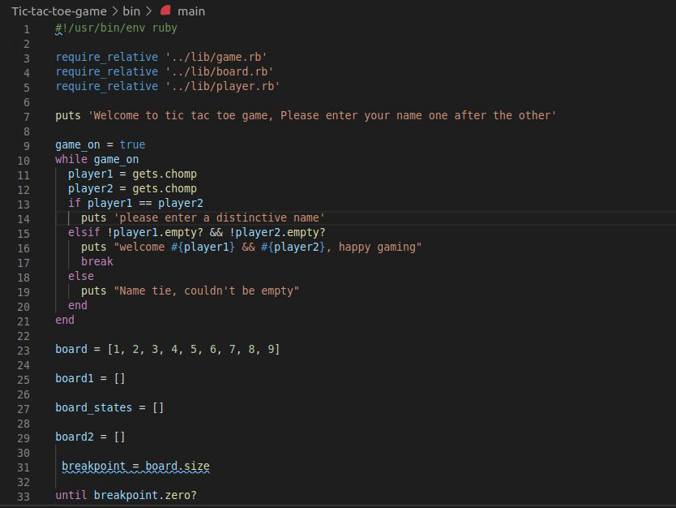

# OOPs-tic-tac-toe

> In this project, we're required to create a Tic Tac Toe Game using Ruby with OOP concepts.

This project is split into 4 milestones, which are:

- Setting up the project
- Designing the user interface
- Creating the game logic
- Writing the game instructions

The main goal of this project is to ensure the mastery of the methods ruby provides and to learn how to replicate them using basic coding knowledge.

## Steps to play the game : 

- Two players starts with a blank board of 9 spaces on a 3 x 3 grid.

- Each play takes turn to place either an "X" or "O"(a marker) on the board.

- The game is won when one player achieve three markers in a row-horizontally, vertically, or diagonally.

- The game is draw when the board is full and there is no winning moves.

- The program needs to guide players along the way and announce the winner if game is won.

## How to install

- Download or clone the repository's files using git@github.com:enaburekhan/Tic-tac-toe-game.git
- Have Ruby 2.7 installed
- Once repo is downloaded to local directory in you console 
- Cd into the local directory and run cmd: main
- Enjoy the game!

## Author

👤 **Eric Enaburekhan**

- Github: [@enaburekhan](https://github.com/enaburekhan)
- Twitter: [@enaburekhaneric](https://twitter.com/enaburekhaneric)
- Linkedin: [@ericenaburekhan](https://www.linkedin.com/in/eric-enaburekhan-801a28100/)

👤 **Tshepo David Molefe**

- Github: [@tshepo](https://github.com/TSHEPO-CLOUD)
- Twitter: [@tshepo](https://twitter.com/tshepomolefe)
- Linkedin: [TSHEPO MOLEFE](https://linkedin.com/tshepo-molefe)

## Show your support

Give a ⭐️ on Github if you like this project!

## Acknowledgments

- My thanks also goes to Microverse and all our peers and colleagues there.

